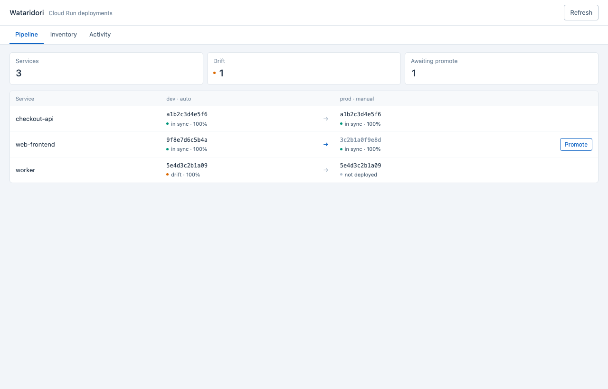
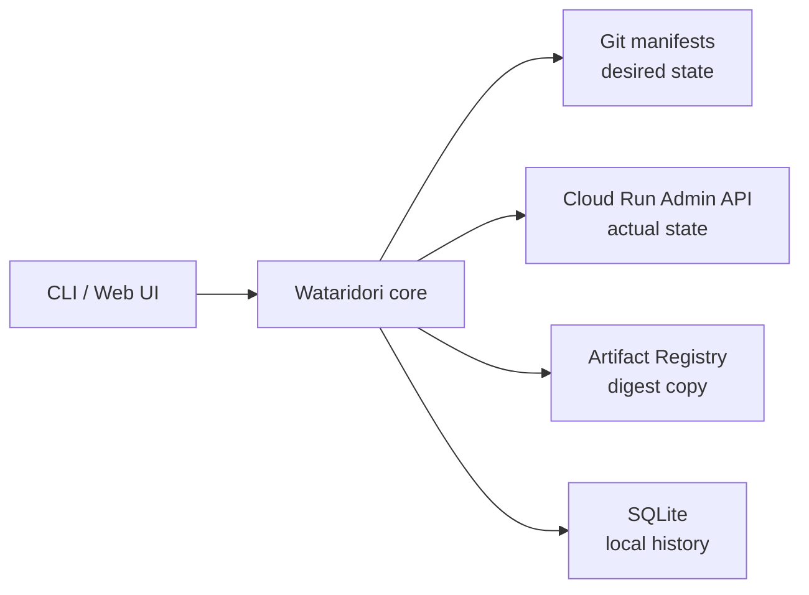

# Wataridori

> Wataridori (渡り鳥, "migratory bird") is a GitOps continuous delivery
> tool built specifically for Google Cloud Run.

Wataridori promotes an already-built container image from one environment to
another by copying its immutable digest. The image that reaches production is
bit-for-bit identical to the image verified in development.



> [!WARNING]
> Wataridori is pre-release software and is not ready for production use.
> `wataridori serve` does not provide application-level authentication yet.
> Do not expose it directly to the public internet. Bind it to a trusted
> interface or place it behind an authenticated proxy such as Google Cloud IAP.

## Why Wataridori?

- **Cloud Run focused.** It does not require a Kubernetes cluster or a
  multi-component control plane.
- **Digest-based promotion.** Production receives the exact artifact tested in
  the source environment, not whatever a mutable tag happens to reference.
- **GitOps state.** Git manifests describe the desired state; the Cloud Run API
  reports the actual state.
- **Safe operations.** Apply, promotion, and rollback are planned before they
  execute, and operations are recorded.
- **One binary.** The CLI, Connect RPC server, controller foundation, and
  embedded React UI ship together.

Wataridori sits between a general-purpose CD platform and shelling out to
`gcloud run deploy` from CI. It intentionally handles delivery of existing
images, not image builds.

## Current capabilities

### CLI

- `apply`: create or update Cloud Run services from manifests
- `promote`: copy image digests between environment manifests and create a Git
  commit
- `rollback`: route 100% of traffic to a previous ready revision
- `status`: compare Git's desired image with the serving Cloud Run image
- `inventory list`: classify managed and unmanaged Cloud Run services
- `history`: inspect locally recorded apply, promote, and rollback operations
- JSON output and a drift-aware exit code for automation

### Server and Web UI

- Connect RPC API generated from [`proto/`](proto/)
- Pipeline board arranged in promotion order
- Environment and service status, drift, revisions, traffic, and readiness
- Promotion planning and execution
- Rollback planning and execution
- Cloud Run revision timeline and Wataridori activity history
- Cloud Run inventory, including unmanaged services
- React + Vite assets embedded in the Go binary

### Not implemented yet

- Authentication and authorization for the Web UI and RPC API
- Shared, durable audit storage for a multi-instance Cloud Run deployment
- Approval gates
- Slack and generic webhook notifications
- A fully wired remote Git clone/pull loop for the controller
- Progressive delivery and automatic rollback

See the [roadmap](docs/roadmap.md) for the release plan.

## Install from source

There is no stable release yet. Until `v0.1.0` is published, install from the
default branch:

```sh
go install github.com/Retr0413/wataridori/cmd/wataridori@master
```

The examples below use the full command name. You may define a local alias:

```sh
alias wtd=wataridori
```

## Quickstart

Prerequisites:

- Go 1.25 or later when installing from source
- a GCP project with the Cloud Run Admin API enabled
- an Artifact Registry image referenced by digest
- Application Default Credentials with the required Cloud Run and Artifact
  Registry permissions
- a Git repository for the Wataridori manifests

Authenticate:

```sh
gcloud auth application-default login
```

Copy [`examples/simple`](examples/simple/) into a new Git repository. Replace
the project, region, service account, and image references with your values.
Image references must be digest-pinned:

```yaml
image: asia-northeast1-docker.pkg.dev/my-project/images/hello@sha256:...
```

Deploy development:

```sh
wataridori apply --env dev
```

Promote the verified digest to production:

```sh
wataridori promote --to prod
git push
wataridori apply --env prod
```

Promotion changes Git; apply changes Cloud Run. Keeping those operations
separate is intentional.

Inspect and recover:

```sh
wataridori status
wataridori inventory list
wataridori history --env prod
wataridori rollback --env prod
```

Run the local Web UI:

```sh
wataridori serve --repo /path/to/manifest-repository --addr 127.0.0.1:8080
```

Open `http://127.0.0.1:8080`.

## Manifest layout

```text
manifest-repository/
├── wataridori.yaml
└── environments/
    ├── dev/
    │   └── hello.yaml
    └── prod/
        └── hello.yaml
```

See [the example guide](examples/README.md) and
[the Phase 1 CLI specification](docs/spec/phase1-cli.md) for the schema.

## Architecture



The database is not a source of deployment truth. Wataridori derives state from
Git and Cloud Run on every operation.

## Documentation

| Document | Purpose |
|---|---|
| [Requirements](docs/requirements.md) | MVP, v1.0, future scope, and non-goals |
| [Architecture](docs/architecture.md) | Components, dependencies, and design decisions |
| [System flows](docs/system-flow.md) | Apply, promotion, rollback, and controller flows |
| [Concepts and glossary](docs/concepts-and-glossary.md) | GitOps and Cloud Run terminology |
| [Roadmap](docs/roadmap.md) | Current implementation status and release plan |
| [CLI specification](docs/spec/phase1-cli.md) | Detailed manifest and command behavior |
| [Cloud Run acceptance test](docs/cloudrun-cli-verification.md) | Real-GCP verification procedure and results |

## Development

```sh
make tools
make gen-check
go test ./...
npm --prefix web run typecheck
npm --prefix web run build
npm --prefix web run test:e2e
```

Generated Go and TypeScript protobuf code is committed. Run `make gen` after
changing the API contract.

## Project scope

Wataridori does not build container images, target runtimes other than Cloud
Run, or reproduce Cloud Logging and Cloud Monitoring. It links to Google Cloud
for logs and metrics.

## License

Apache License 2.0. See [LICENSE](LICENSE).
