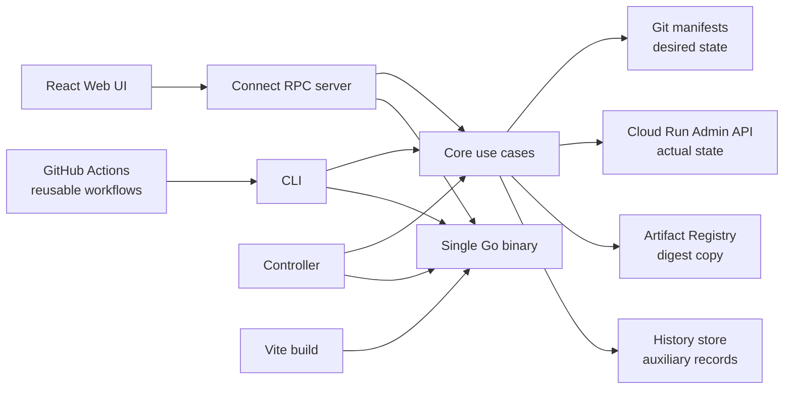

# Architecture

## Overview

Detailed command and controller sequences are documented in
[system-flow.md](system-flow.md). Terms are defined in
[concepts-and-glossary.md](concepts-and-glossary.md).

## Design principles

### One binary

The CLI, Connect RPC server, controller foundation, and embedded Web UI ship in
one Go binary. Wataridori can therefore run locally or as a Cloud Run service
without operating a separate frontend deployment or control plane.

### Two sources of truth

- **Desired state:** Git manifests
- **Actual state:** Cloud Run Admin API

The history database is auxiliary. It must never become the authoritative
source for the current image, revision, or traffic allocation.

### Immutable promotion

An environment manifest references an image with `@sha256:...`. Promotion
copies that digest into the target manifest. If the target uses another
Artifact Registry repository, Wataridori copies the content by digest and keeps
the target repository path.

### Plan before mutation

Apply, promotion, and rollback calculate structured plans. CLI confirmation and
the Web UI display those plans before calling the execution operation.

## Components

| Component | Responsibility |
|---|---|
| `cmd/wataridori` | Process entrypoint |
| `internal/cli` | Cobra commands, flags, confirmation, and rendering |
| `internal/core` | Apply, promotion, rollback, status, inventory, history, and timeline use cases |
| `internal/manifest` | YAML types, loading, validation, and digest updates |
| `internal/cloudrun` | Cloud Run Admin API v2 wrapper |
| `internal/registry` | Digest existence verification and digest-based registry copy |
| `internal/gitops` | Commits and remote Git synchronization primitives |
| `internal/store` | Local SQLite operation history |
| `internal/server` | Connect RPC handlers and protobuf conversion |
| `internal/controller` | Periodic and triggered reconciliation |
| `proto` | API contract and generated-code input |
| `web` | React UI, generated client, and embedded build output |
| `actions/setup` | Installs and checksum-verifies a pinned CLI release in consumer workflows |
| `.github/workflows/reusable-*` | Read-only validation, dev delivery, promotion-PR preparation, and manual prod apply |

Dependencies point toward `internal/core`; UI and CLI rendering do not belong in
the use-case layer.

## API

[`proto/wataridori/v1/wataridori.proto`](../proto/wataridori/v1/wataridori.proto)
is the API's single source of truth. Buf generates:

- Go protobuf and Connect handlers in `gen/`
- TypeScript protobuf and service descriptors in `web/src/gen/`

The browser uses the Connect protocol. JSON and binary protobuf are transport
choices; the protobuf schema defines the contract in both cases.

## Cloud Run integration

Wataridori uses `cloud.google.com/go/run/apiv2`.

- Updating a service creates a Cloud Run revision.
- Status compares the serving revision's digest with Git.
- Rollback changes traffic to a previous ready revision.
- Timeline reads revision history from Cloud Run, independently from the local
  Wataridori activity database.

Full log and metric rendering is intentionally delegated to Google Cloud
Console deep links.

## GitHub Actions boundary

Reusable workflows are adapters around the CLI rather than another control
plane. Consumer repositories own their event triggers and permissions; the
called workflows cannot elevate them.

- application CI supplies an already-built digest-pinned image
- an Artifact Event records source repository, commit, workflow run, and digest
- only `policy:auto` environments accept event-driven desired-state updates
- Git changes land before the corresponding Cloud Run apply
- dev apply may run automatically from the protected default branch
- promotion inspection compares Git, Cloud Run, Artifact Registry, and bounded
  HTTP readiness checks before a prod pull request is prepared
- the pull request carries immutable, machine-readable promotion evidence and
  is updated idempotently per environment and service
- the promotion pull request is never auto-merged
- prod apply has only a manual dispatch entrypoint, verifies that the selected
  commit belongs to the protected default branch, and uses a protected GitHub
  Environment

GCP credentials are short-lived credentials obtained through GitHub OIDC and
Workload Identity Federation. Cross-repository Git writes require a caller-
supplied GitHub App installation token; Wataridori does not broaden the default
`GITHUB_TOKEN` scope.

Cloud Run mutation has two explicit modes. `full` reconstructs the service from
the Wataridori manifest and retains the existing unmanaged-setting guard.
`image-only` requires an existing service, reads it, changes only the primary
container image, and updates the `template.containers` field. This mode lets
Terraform remain authoritative for probes, networking, scaling, IAM, secrets,
and other service configuration.

## Authentication boundaries

GCP access uses Application Default Credentials locally and should use a
dedicated service account through Workload Identity on Cloud Run.

Application-level Web and RPC authentication is not implemented yet. The
planned hosted model is IAP or OIDC plus request-level authorization and a
human principal recorded in the audit history.

## Hosted-state limitation

SQLite works for a local single-process workflow. A Cloud Run filesystem is
ephemeral, and multiple instances do not share one SQLite file. Hosted
multi-user operation therefore requires a durable shared history and approval
store before v1.0.

## Technology

| Layer | Technology |
|---|---|
| Backend and CLI | Go, Cobra |
| Cloud Run | Cloud Run Admin API v2 |
| Registry | go-containerregistry |
| Git | go-git |
| API | Connect RPC and protobuf |
| Web | TypeScript, React, Vite, TanStack Query |
| Local history | SQLite |
| Build and release | GitHub Actions, Buf, GoReleaser, ko |

## Distribution

GoReleaser builds Linux and macOS binaries for amd64 and arm64, checksums, and
a distroless GHCR image. No stable release has been published yet.
