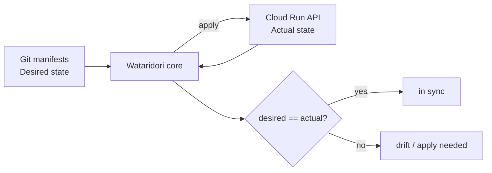
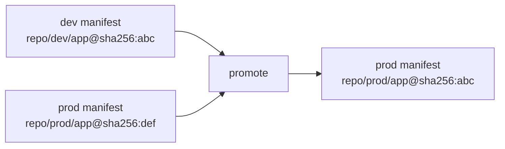
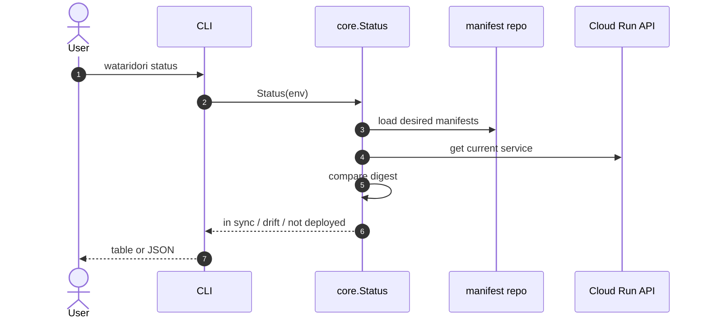
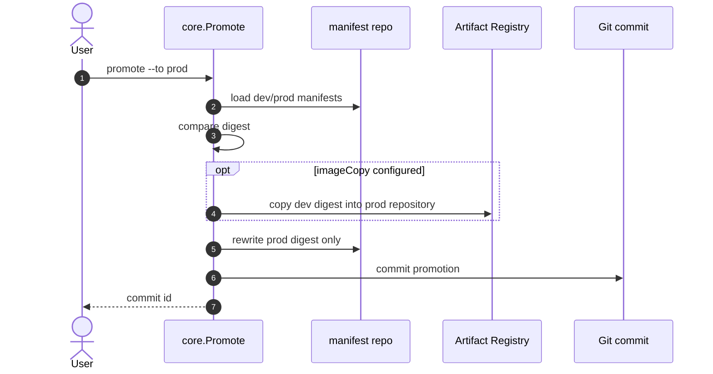
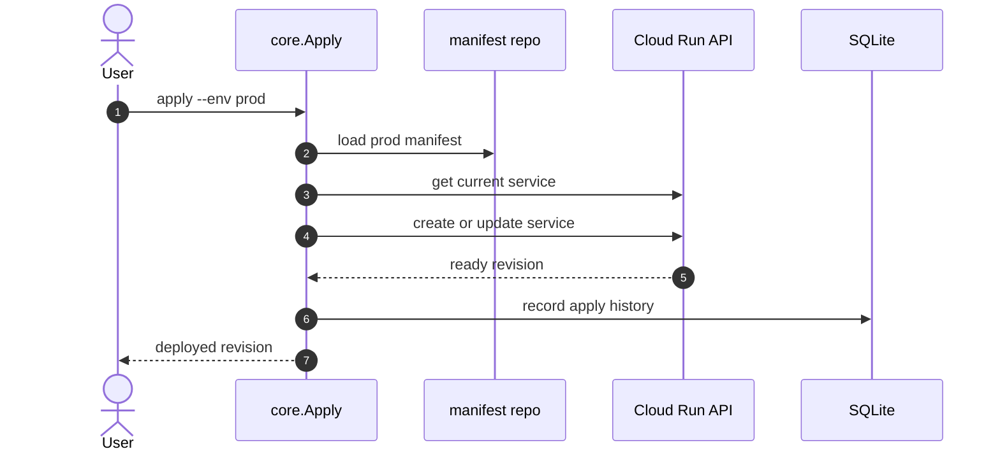
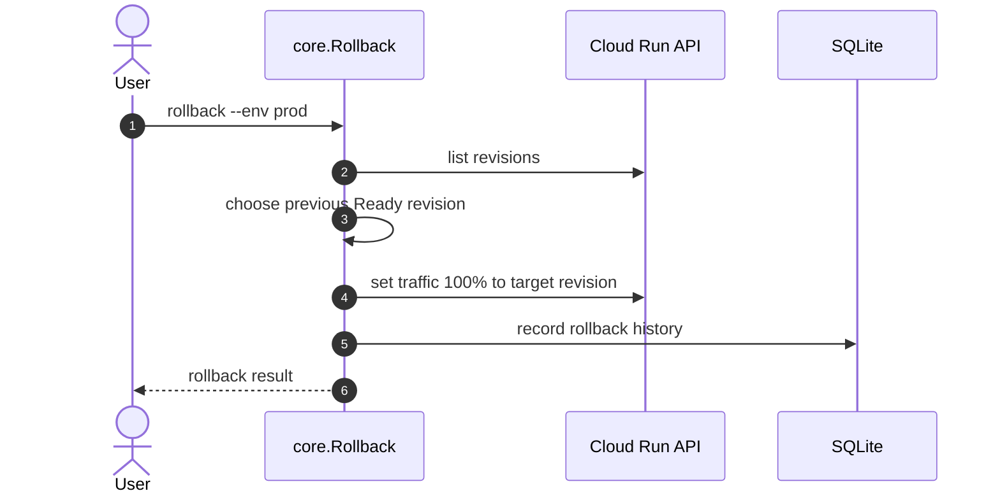
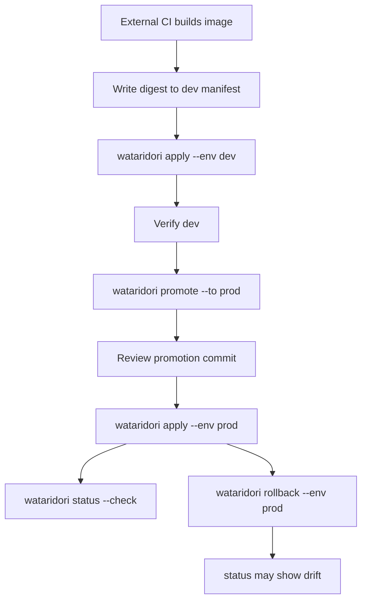

# Wataridori Concepts and Glossary

Wataridori は、Cloud Run に特化した GitOps CD ツールである。
中心にある考え方は「Git に書いたあるべき状態を Cloud Run の実状態へ反映し、
dev で確認した container image digest を prod へ昇格する」ことである。

この文書は、Wataridori がどう動いているのか、なぜその仕組みで安全に動くのか、
そしてよく出てくる用語が何を意味するのかを整理する。

## 一言でいうと

Wataridori は、次の 3 つを突き合わせて動く。

| 種類 | 何を見るか | Wataridori での扱い |
|---|---|---|
| あるべき状態 | Git 上の manifest | `wataridori.yaml` と `environments/<env>/*.yaml` |
| 実際の状態 | Cloud Run API | service / revision / traffic / image digest |
| 操作履歴 | SQLite | `apply` / `promote` / `rollback` の補助記録 |

DB は現在状態の真実ではない。現在状態は Git と Cloud Run API を毎回見て判断する。

## なぜ GitOps CD として動くのか

GitOps CD は「Git に書かれた desired state を実環境へ近づける」考え方である。
Wataridori では desired state が service manifest、actual state が Cloud Run service になる。

この設計が成立する理由は、Cloud Run が API から現在の service / revision / traffic を取得でき、
かつ service 更新時に image digest を明示して新しい revision を作れるためである。

## なぜ digest 昇格なのか

container image の tag は後から同じ名前で別の中身を指せる。
たとえば `my-app:latest` は昨日と今日で違う image になり得る。

一方、digest は image の内容から決まる識別子である。
`@sha256:...` で参照すれば、dev で確認した image と prod に出す image が bit 単位で同じだと判断できる。

Wataridori の `promote` は tag を動かさない。
昇格元 manifest の digest だけを昇格先 manifest に書き写す。

重要なのは、prod の image path は維持して digest だけを更新する点である。
dev / prod で Artifact Registry repository が分かれている場合でも、prod 側の repository path を保てる。

## コマンドごとの責務

### `status`

`status` は Git の desired image と Cloud Run の actual image を比較する。
Cloud Run に service がなければ `not deployed`、digest が違えば `drift`、一致すれば `in sync` になる。

実装上は `internal/core/status.go` が中心で、manifest loader と Cloud Run client を使う。

### `promote`

`promote` はデプロイではない。
昇格元の digest を昇格先 manifest に反映し、Git commit を作る操作である。

実装上は `internal/core/promote.go` が中心で、必要に応じて `registry.Copier` が image copy を行い、
`gitops.Committer` が commit を作る。

この分離により、昇格は Git の変更としてレビューできる。
prod への実反映は、次の `apply` で行う。

### `apply`

`apply` は manifest の内容を Cloud Run に反映する。
service がなければ作成し、あれば更新する。
Cloud Run は更新ごとに revision を作るため、どの image がどの revision で動いたかを追いやすい。

実装上は `internal/core/apply.go` が中心で、Cloud Run への実操作は `internal/cloudrun` が担当する。

### `rollback`

`rollback` は manifest を書き換えない。
Cloud Run の revision 履歴から、現在 traffic を受けている revision より古い Ready revision を選び、
traffic を 100% 戻す。

実装上は `internal/core/rollback.go` が中心で、Cloud Run の `traffic` 更新を使う。

rollback 後は Cloud Run の actual state だけが戻るため、Git manifest とずれることがある。
このずれは `status` で `drift` として見える。

## なぜ Cloud Run に特化しているのか

Cloud Run には、CD ツールとして使いやすい性質がある。

- service update で revision が自動作成される
- previous revision が残るため rollback が軽い
- traffic を revision 単位で切り替えられる
- 将来的に traffic split で canary / blue-green ができる
- Cloud Run Admin API v2 で service 状態を構造化して取得できる

Wataridori はこの Cloud Run の性質に寄せることで、Kubernetes 汎用 CD より小さく作れる。

## 実装上の分担

| Package | 役割 |
|---|---|
| `cmd/wataridori` | `main`。CLI entrypoint |
| `internal/cli` | cobra command、flag、確認 prompt、table / JSON 出力 |
| `internal/core` | `apply` / `promote` / `rollback` / `status` / `history` の use case |
| `internal/manifest` | YAML schema、load、validate、digest helper |
| `internal/cloudrun` | Cloud Run Admin API v2 の adapter |
| `internal/registry` | Artifact Registry / OCI registry への image copy |
| `internal/gitops` | promotion commit の作成 |
| `internal/store` | SQLite history |
| `internal/server` | Connect RPC server |
| `proto` | API contract の単一ソース |
| `web` | embedded Web UI |

依存の向きは、基本的に `cli/server -> core -> adapters` である。
CLI と Web UI は同じ core use case を使うため、画面と CLI で動作がずれにくい。

## 用語集

| 用語 | 意味 |
|---|---|
| CD | Continuous Delivery / Deployment。build 済み artifact を環境へ届ける仕組み |
| CI | Continuous Integration。test や image build を行う仕組み。Wataridori では対象外 |
| GitOps | Git を desired state のソースにして実環境を同期する運用方式 |
| desired state | Git manifest に書かれた「こうあるべき」状態 |
| actual state | Cloud Run API から取得した「実際に今動いている」状態 |
| drift | desired state と actual state がずれている状態 |
| manifest | service の image / env / resources / scaling などを書いた YAML |
| digest | container image の内容を表す `sha256` 識別子。tag より再現性が高い |
| tag | `:latest` や `:v1.2.3` のような image 名のラベル。後から別 image を指せる |
| promotion / 昇格 | dev の digest を prod manifest へ書き写す操作 |
| apply | manifest の desired state を Cloud Run へ反映する操作 |
| rollback | Cloud Run の traffic を過去の Ready revision に戻す操作 |
| revision | Cloud Run service の immutable な実行単位。service 更新ごとに作られる |
| traffic | Cloud Run がどの revision に何 % のリクエストを流すかの設定 |
| Artifact Registry | GCP の container image registry |
| imageCopy | dev / prod repository が分かれる場合に、同じ digest の image を prod 側へコピーする設定 |
| ADC | Application Default Credentials。ローカルや Cloud Run 上で GCP API 認証に使う標準方式 |
| Connect RPC | Protocol Buffers を使った RPC framework。Go server と TypeScript client の型を揃えやすい |
| SQLite | ローカルファイル DB。Wataridori では操作履歴の補助記録に使う |
| controller | Phase 2 で Git の変更を検知し、自動で `apply` 相当を行う常駐処理 |
| policy:auto | 環境を自動追従対象にする設定。Phase 2 controller で使う |
| policy:manual | 明示的な昇格や apply を必要とする設定。prod 向け |

## 典型的な運用の流れ

Wataridori が扱うのは、CI が作った image をどの環境に届けるかである。
image build 自体は GitHub Actions など外部 CI に任せる。

## よくある誤解

### `promote` すれば prod に出るのか

出ない。`promote` は Git manifest を更新して commit を作るだけである。
Cloud Run への反映は `apply --env prod`、または Phase 2 の controller が行う。

### rollback すると Git manifest も戻るのか

戻らない。rollback は Cloud Run traffic の操作である。
恒久的に戻すなら manifest も戻す必要がある。

### SQLite が正しい状態を持っているのか

持っていない。SQLite は履歴の補助記録である。
現在状態の判断は Git manifest と Cloud Run API で行う。

### なぜ Kubernetes ではなく Cloud Run だけなのか

Cloud Run に絞ることで、revision / traffic / Admin API という Cloud Run 固有の仕組みを素直に使える。
汎用性よりも導入の軽さと運用のわかりやすさを優先している。

