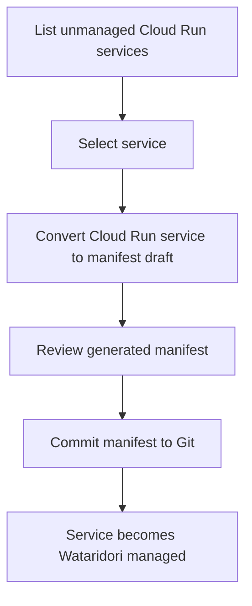
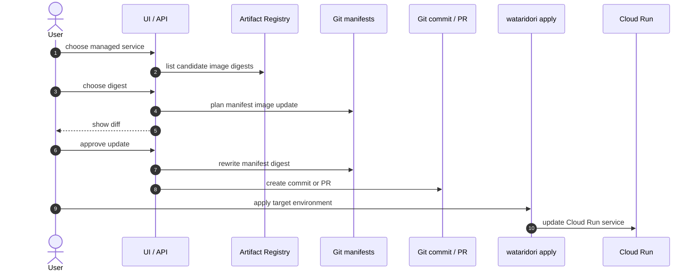

# GitOps-Preserving Cloud Run Management

Wataridori は Cloud Run の管理画面ではなく、Cloud Run に特化した GitOps CD ツールである。
そのため、新しい Cloud Run 管理機能を追加する場合も、標準導線では Git を source of truth として維持する。

この文書では、既存 Cloud Run service の一覧・取り込み・image 更新を、
GitOps を崩さずに Wataridori へ追加する方針を整理する。

## 問題意識

現在の Wataridori は、manifest repository に書かれている service を中心に扱う。

```text
manifest にある service
  -> Wataridori managed service

manifest にない Cloud Run service
  -> Wataridori からは基本的に見えない
```

しかし実運用では、既に Cloud Run 上に service が存在しているケースが多い。
OSS として使いやすくするには、以下が必要になる。

- GCP project / region に存在する Cloud Run service を一覧できる
- どれが Wataridori 管理対象か判定できる
- 既存 service を manifest 化して取り込める
- 管理対象 service の image を安全に更新できる
- 直接 Cloud Run を触った結果の drift を検知できる

## 守るべき境界

標準機能では、Cloud Run を直接更新して Git を置き去りにしない。

```text
Good:
  UI/API 操作
    -> manifest 更新
    -> Git commit / PR
    -> apply
    -> Cloud Run 更新

Bad:
  UI/API 操作
    -> Cloud Run 直接更新
    -> Git manifest は古いまま
```

後者はすぐに `drift` を作れるため、緊急操作としては価値がある。
ただし通常導線にすると、Wataridori は GitOps CD ツールではなく Cloud Run 操作 UI になってしまう。

## 推奨する機能分解

### 1. Cloud Run Inventory

Cloud Run API から project / region 内の service を一覧する読み取り専用機能。

目的:

- 既存 Cloud Run service を把握する
- manifest 管理対象かどうかを判定する
- drift / unmanaged service を見つける

表示したい項目:

| 項目 | 説明 |
|---|---|
| project | GCP project |
| region | Cloud Run region |
| service | Cloud Run service name |
| managed | manifest に存在するか |
| desired image | manifest 上の image |
| actual image | Cloud Run で serving している image |
| revision | serving revision |
| traffic | revision traffic |
| ready | Ready condition |
| url | service URL |
| console url | Cloud Console deep link |

`managed` 判定は以下で行う。

```text
Cloud Run service name + environment project/region
  matches
manifest service name + environment project/region
```

最初は `wataridori.yaml` に定義済みの project / region だけを scan 対象にする。
任意 project の広域 scan は IAM scope と UI 複雑度が上がるため後回しにする。

### 2. Import Existing Service

Cloud Run 上に存在する unmanaged service を Wataridori の manifest に変換する機能。

流れ:



Import で扱うフィールドは、Phase 1 manifest schema に存在するものに絞る。

- `name`
- `image`
- `env`
- `resources`
- `scaling`
- `serviceAccount`
- `concurrency`
- `port`

VPC / secret / volume / custom probe など、まだ Wataridori schema にないフィールドは
最初は warning として表示する。
勝手に落として apply すると危険なので、import plan に「未対応フィールドあり」を明示する。

### 3. Managed Image Update

管理対象 service の image を更新する機能。
これは Cloud Run を直接更新せず、manifest を更新する。

流れ:



この機能は `promote` と似ているが、昇格元環境を使わない。
ユーザーが Artifact Registry の digest を選び、対象 environment の manifest に反映する。

想定ユースケース:

- hotfix image を prod manifest に明示的に指定したい
- staging だけ別 digest にしたい
- dev の自動追従前に手動で digest を試したい

ただし prod への更新は、承認ゲートや PR 化と組み合わせる。

### 4. Break-Glass Direct Deploy

Git を経由せず Cloud Run を直接更新する緊急操作。
これは標準導線にしない。

許可する場合の条件:

- 機能名に `break-glass` / `emergency` を明示する
- 理由入力を必須にする
- actor / reason / old image / new image / revision を audit log に残す
- 実行後に `drift` を強く表示する
- drift を manifest に取り込む follow-up action を出す
- prod では追加承認を要求する

この機能は安全装置であり、通常の image update 機能ではない。

## API の発展案

Connect RPC は、既存の `DeploymentService` にすべて詰め込むより、
Cloud Run inventory 系を別 service に切る方が分かりやすい。

```proto
service CloudRunInventoryService {
  rpc ListServices(ListServicesRequest) returns (ListServicesResponse) {}
  rpc GetService(GetServiceRequest) returns (GetServiceResponse) {}
  rpc PlanImport(PlanImportRequest) returns (PlanImportResponse) {}
  rpc ExecuteImport(ExecuteImportRequest) returns (ExecuteImportResponse) {}
}

service ImageUpdateService {
  rpc ListImageDigests(ListImageDigestsRequest) returns (ListImageDigestsResponse) {}
  rpc PlanImageUpdate(PlanImageUpdateRequest) returns (PlanImageUpdateResponse) {}
  rpc ExecuteImageUpdate(ExecuteImageUpdateRequest) returns (ExecuteImageUpdateResponse) {}
}
```

Phase 2 初期では、まず `ListServices` と `PlanImport` だけでも価値がある。
write 系の `ExecuteImport` / `ExecuteImageUpdate` は Git commit / PR 作成の設計と一緒に進める。

初期実装では、既存の `DeploymentService` に read-only の `Inventory` RPC を追加する。
これは UI からの一覧表示を先に可能にするための小さな入口であり、write 系 API が増える段階で
`CloudRunInventoryService` として分離する。

## CLI の発展案

UI だけでなく CLI からも同じ機能を使えるようにする。

```bash
# Cloud Run 上の service を一覧し、managed / unmanaged を表示する
wataridori inventory list --env prod

# unmanaged service から manifest draft を生成する
wataridori import cloudrun --env prod --service my-api --dry-run

# 生成 manifest を commit する
wataridori import cloudrun --env prod --service my-api

# Artifact Registry の digest を選んで manifest 更新 plan を出す
wataridori image update --env prod --service my-api --image repo/my-api@sha256:...

# 緊急 direct deploy。標準機能ではなく明示的に危険な操作として扱う
wataridori break-glass deploy --env prod --service my-api --image repo/my-api@sha256:...
```

## UI の発展案

Web UI は「Cloud Run を直接いじれる画面」ではなく、
「GitOps 管理状態を理解して安全に変更を作る画面」として設計する。

画面構成:

1. Inventory
   - managed / unmanaged service 一覧
   - drift 状態
   - current revision / traffic / Ready
2. Import
   - unmanaged service の manifest draft
   - 未対応フィールド warning
   - commit / PR 作成
3. Image Update
   - Artifact Registry digest picker
   - manifest diff
   - commit / PR 作成
4. Apply / Promote / Rollback
   - 既存の use case を UI から実行
5. Break-glass
   - 通常画面から分離
   - 強い警告と audit reason

## Phase への落とし込み

### Phase 2 に入れる

- Cloud Run Inventory(read-only)
- managed / unmanaged 判定
- Cloud Console deep link
- Drift 詳細

理由:

- GitOps を壊さない
- UI の価値が大きい
- write path より安全に追加できる

### Phase 2.5 に入れる

- Import Existing Service
- Import plan / manifest draft
- Git commit / PR 作成

理由:

- 既存 Cloud Run 利用者の導入障壁を下げる
- Wataridori の managed service を増やせる

### Phase 3 以降に入れる

- Managed Image Update
- Artifact Registry digest picker
- 承認ゲート連携
- break-glass direct deploy

理由:

- prod 更新の安全設計が必要
- 認証認可・承認・audit log と強く関係する
- 直接 deploy は GitOps から外れるため、最後に扱うべき

## 判断

この方向の機能追加は、Wataridori にとって自然である。
ただし「任意の Cloud Run service を UI から直接 image update する」ではなく、
以下の順で育てるのがよい。

1. まず全体を見えるようにする
2. GitOps 管理対象かどうかを判定する
3. unmanaged service を manifest に取り込む
4. manifest を更新する形で image update する
5. apply / controller で Cloud Run に反映する
6. direct deploy は緊急操作として隔離する

これなら、Cloud Run 管理体験を強化しながら、Wataridori の核である
「Git を source of truth にする CD ツール」という立ち位置を維持できる。
