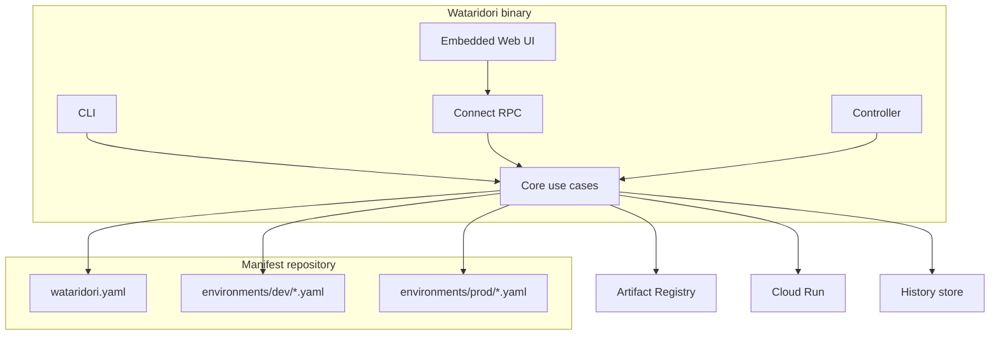
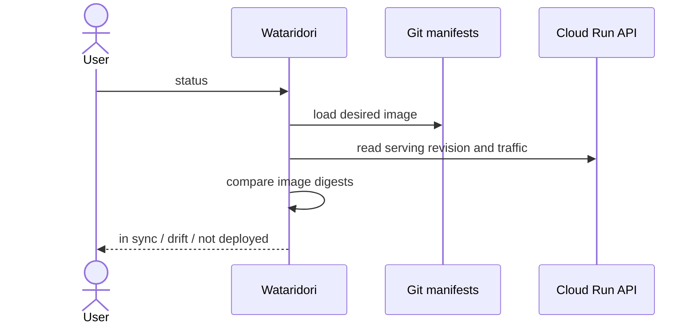
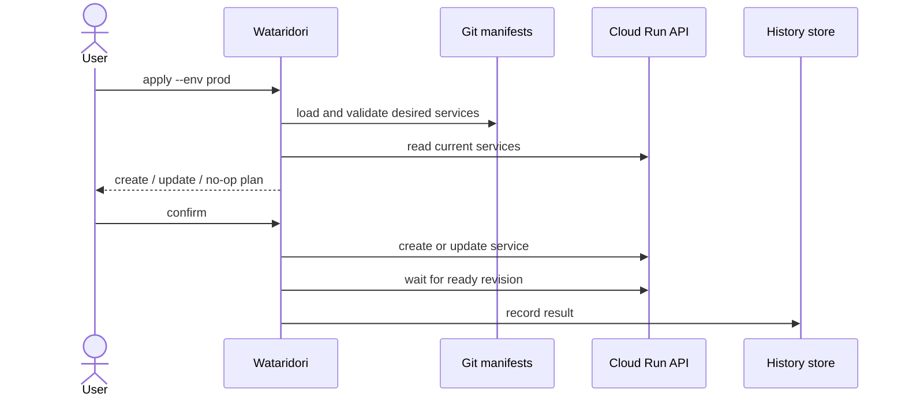
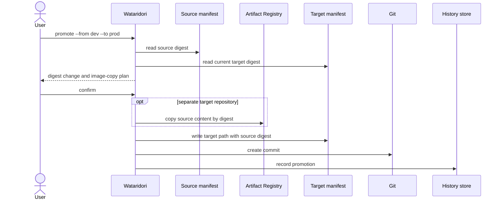
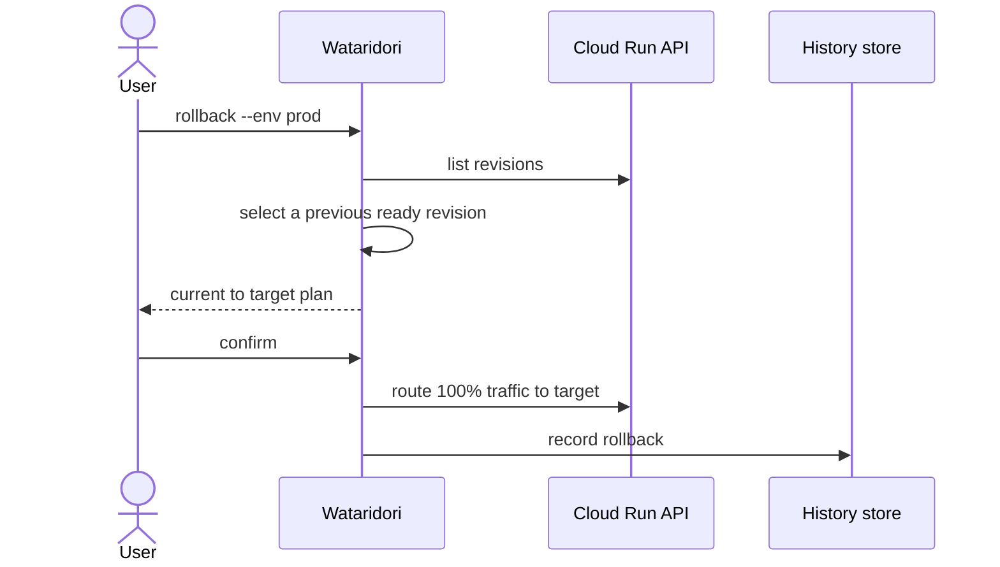
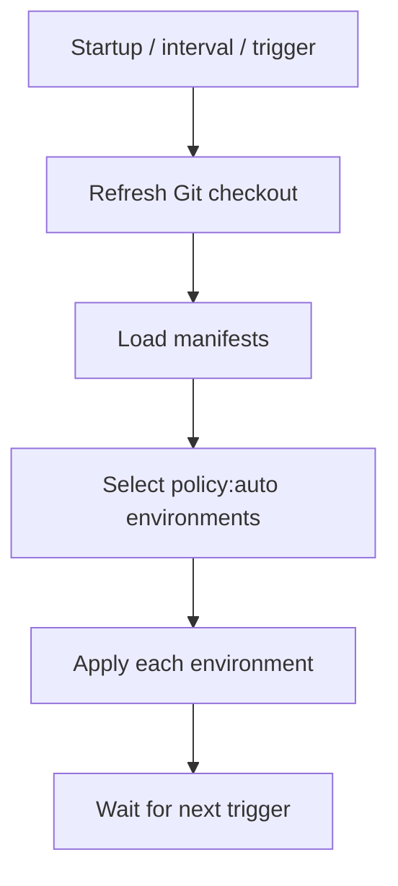
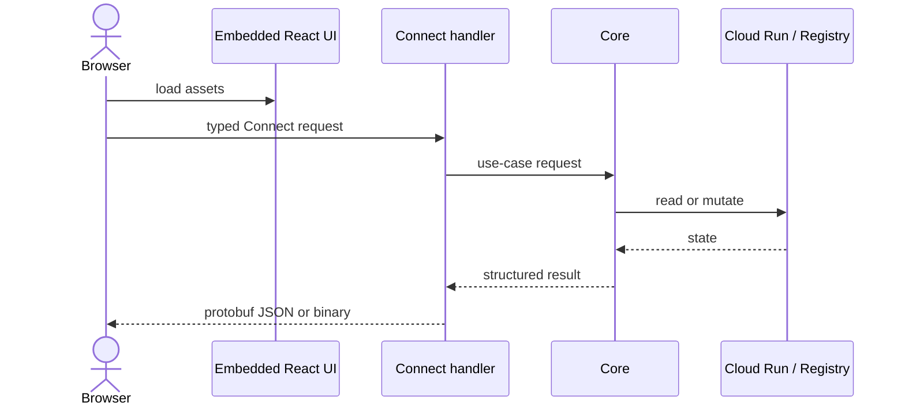

# System flows

Wataridori reconciles a Git-declared image digest with the revision serving in
Cloud Run.

## Runtime model



## Status



Status is read-only. `--check` exits with code 2 when drift exists, making it
suitable for automation.

## Apply

Apply changes Cloud Run, not Git.



`--dry-run` stops after planning. Apply preserves selected Cloud Run fields that
are not controlled by the Wataridori manifest, avoiding accidental deletion of
platform-managed configuration.

## Promotion

Promotion changes Git, not Cloud Run.



The user pushes the commit and applies the target environment. PR-based
promotion is planned for `v0.1.0`.

## Rollback

Rollback is an explicit recovery operation against Cloud Run.



Rollback may intentionally create drift because Git can still point to the
newer image. Operators must then decide whether to revert Git or re-apply the
desired revision.

## Inventory

Inventory lists Cloud Run services from configured projects and regions, then
joins them with manifests.

```text
Cloud Run + manifest -> managed and in sync
Cloud Run + no manifest -> unmanaged
manifest + no Cloud Run service -> not deployed
both + different digest -> drift
```

Inventory is read-only and does not adopt unmanaged services.

## Timeline and activity

- **Timeline** reads Cloud Run revisions. It shows deployment facts even when
  another tool performed the deployment.
- **Activity** reads Wataridori's history store. It records Wataridori
  operations and actor metadata.

The views are complementary and must not be presented as the same data source.

## Controller



The controller loop and Git synchronization primitives exist, but the hosted
`serve` command does not yet wire a remote repository clone/fetch into each
cycle. Today it reloads a local checkout.

## Web request flow



The current server is stateless at the RPC layer: it re-derives execution plans
instead of storing browser sessions. Authentication and hosted authorization
remain v1.0 work.
