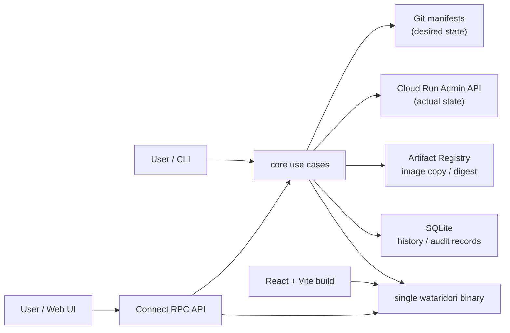
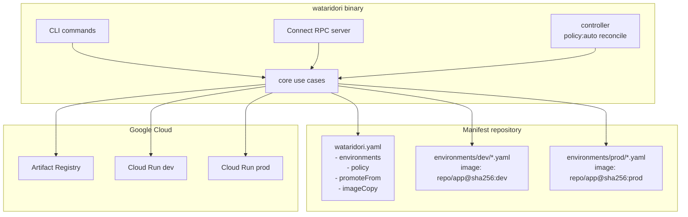
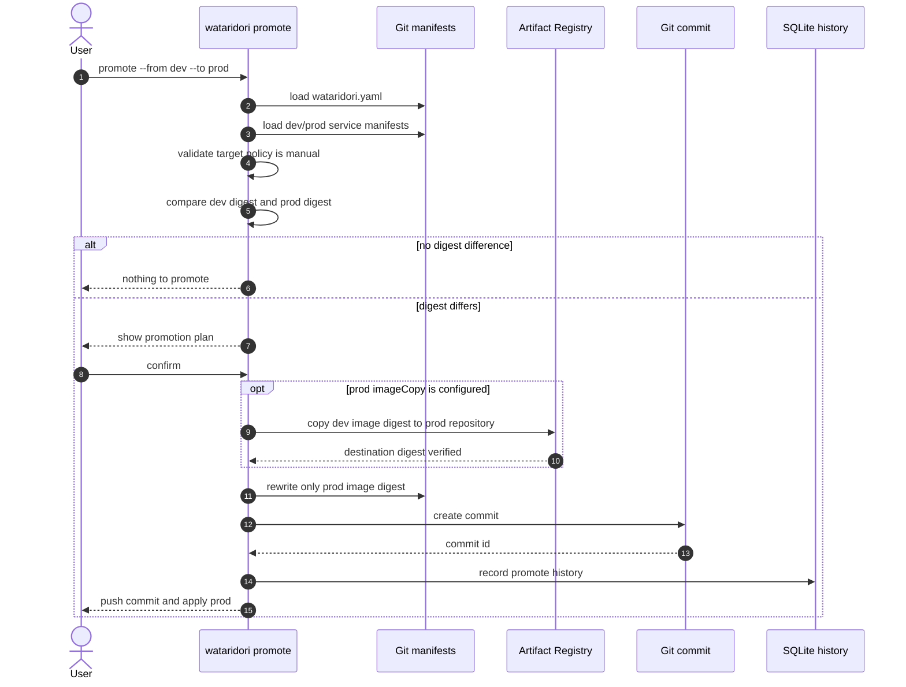
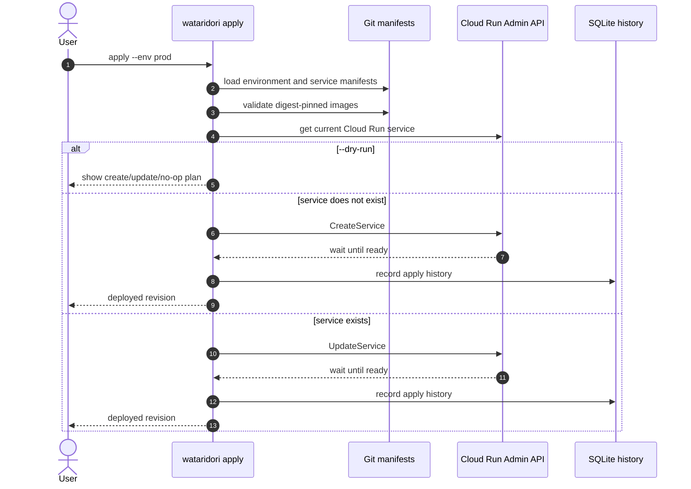
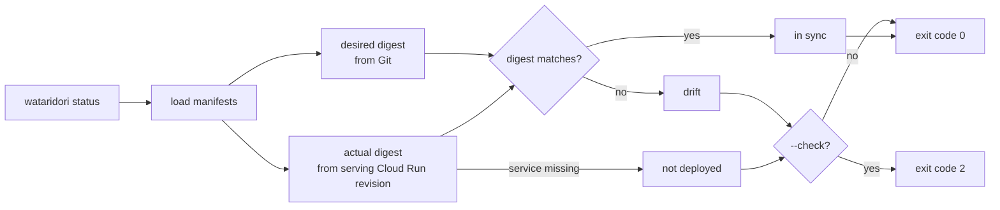
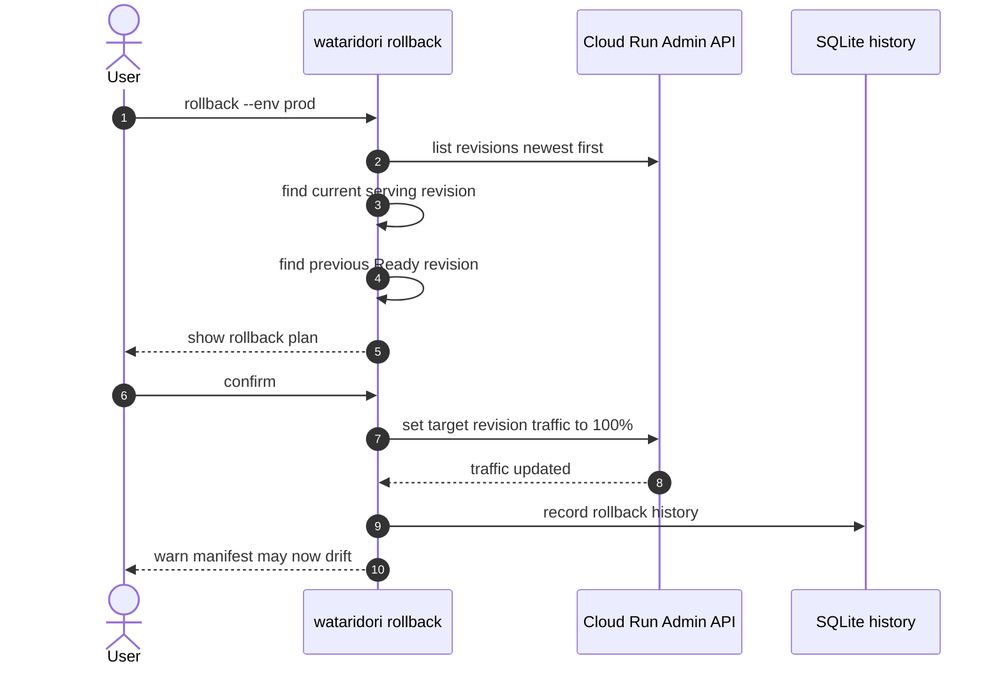
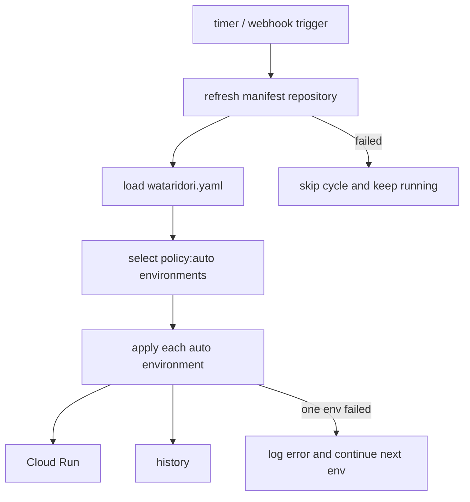
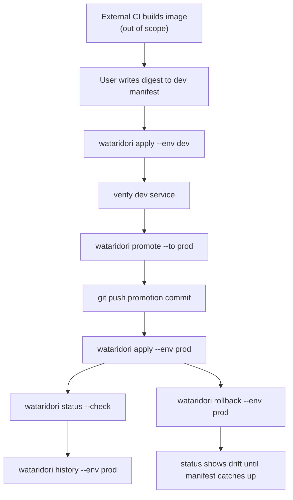

# システムフロー

Wataridori は Cloud Run に特化した GitOps CD ツールであり、中心は
「Git 上のマニフェストに書かれた digest を、Cloud Run の実際の状態へ反映する」ことにある。
このドキュメントでは、OSS 本体がどのように動くかをフローとして整理する。

## フロントエンドの位置付け

フロントエンドは OSS 本体に含める。ただし Phase 1 の必須要件ではなく、Phase 2 以降で
単一 Go バイナリに embed する Web UI として実装する。

理由は以下の通り。

- 昇格・apply・rollback は運用上の重要操作なので、CLI だけではチーム内の可視性が不足しやすい
- 環境ごとの状態、drift、履歴、承認待ちを一覧できる UI は v1.0 の価値に直結する
- 別サービスとして分離すると導入コストが上がるため、Wataridori の「単一バイナリ」という設計価値を損なう
- 先に CLI / core / proto / Connect RPC を固めることで、UI は同じ use case を呼ぶ薄い表示層にできる

したがって、実装方針は「CLI first, API shared, UI embedded」とする。

## 全体モデル

Wataridori が扱う真実は 2 つだけである。

- あるべき状態: Git 上の `wataridori.yaml` と service manifest
- 実際の状態: Cloud Run Admin API から取得する service / revision / traffic

SQLite は履歴・承認記録の補助であり、現在状態の真実にはしない。

## 昇格フロー

昇格はデプロイではない。昇格は、昇格元環境の service manifest にある digest を、
昇格先環境の service manifest に書き写して Git commit を作る操作である。

環境ごとに Artifact Registry が分かれている場合は、書き換え前に digest 指定でイメージをコピーする。
このときコピーされるのはタグではなく digest であり、bit 単位で同一のイメージを保証する。

重要な制約:

- `env` / `resources` / `scaling` などの環境固有設定は昇格しない
- 昇格先の image path は維持し、digest だけを更新する
- `promote` は push / PR 作成をしない
- `promote` は Cloud Run にデプロイしない

## Apply フロー

`apply` は Git 上のあるべき状態を Cloud Run に反映する操作である。
service が存在しなければ作成し、存在すれば manifest に合わせて更新する。

## Status と Drift 検知

`status` は Git の desired digest と Cloud Run の actual serving revision digest を比較する。
Cloud Run service が存在しない場合は `not deployed`、digest が異なる場合は `drift` とする。

## Rollback フロー

`rollback` は Git manifest を書き換えない。Cloud Run の revision 履歴を使って、
現在 traffic を受けている revision より古い Ready revision に traffic を 100% 戻す。

そのため rollback 後は、Git の desired digest と Cloud Run の actual digest がずれる可能性がある。
このずれは `status` で drift として表示される。

## Phase 2 Controller フロー

Phase 2 では `policy:auto` の環境を controller が reconcile する。
これは Git の変更を検知して `apply` 相当の処理を走らせるものであり、CI のイメージビルドは扱わない。

## 推奨する利用フロー

Phase 1 の基本運用は以下の通り。

